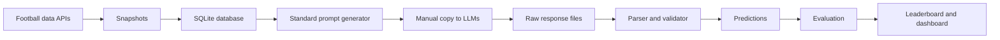

# AI World Cup

A reproducible benchmark for comparing LLM predictions on FIFA World Cup 2026.

AI World Cup does **not** call LLM APIs. It generates standardized prompts that you manually copy into models such as ChatGPT, Claude, Gemini, Grok, Perplexity, DeepSeek, Mistral, or Qwen. You then save each raw model answer and import it back into this repository for validation, storage, scoring, and comparison.



## Setup

```bash
python -m venv .venv
source .venv/bin/activate
pip install -e ".[dev]"
cp .env.example .env
```

## Recommended Workflow: One Full-Tournament Prompt

```bash
aiwc data sync --sources openfootball,worldcup26
aiwc data status

aiwc prompts generate-tournament --version v1
aiwc prompts list
```

Send the generated tournament prompt manually to each LLM. Save each raw response exactly as returned:

```text
data/responses/manual/chatgpt_gpt5_tournament_v1.json
data/responses/manual/claude_opus_tournament_v1.json
data/responses/manual/gemini_25_pro_tournament_v1.json
```

Import, evaluate, and compare:

```bash
aiwc responses import-tournament \
  --prompt-id PROMPT_ID \
  --model-name "ChatGPT GPT-5" \
  --provider "OpenAI" \
  --response-file data/responses/manual/chatgpt_gpt5_tournament_v1.json

aiwc evaluate tournament --completed-only
aiwc leaderboard tournament
aiwc dashboard
```

The old match-by-match workflow is still available when you want more granular manual prompts:

```bash
aiwc prompts generate-upcoming --limit 10 --version v1
aiwc responses import \
  --prompt-id PROMPT_ID \
  --model-name "ChatGPT GPT-5" \
  --provider "OpenAI" \
  --response-file data/responses/manual/chatgpt_gpt5_match_001.json
aiwc evaluate matches --completed-only
aiwc leaderboard matches
```

## Manual LLM Submission Protocol

1. Generate the prompt from the repo.
2. Copy the full prompt.
3. Send the exact same prompt to each LLM.
4. Do not modify the prompt between models.
5. Save the raw answer exactly as returned.
6. Import the answer into the repo.
7. Keep prompt version and data snapshot fixed for fair comparison.

## Data Sources

- OpenFootball: no API key.
- worldcup26.ir: no API key, with graceful fallback for unavailable endpoints.
- football-data.org: optional `FOOTBALL_DATA_TOKEN`.
- API-Football: optional `API_FOOTBALL_KEY`.

No LLM API keys are used or documented. The LLM comparison workflow is fully offline after you manually collect model responses.

## Required Tournament Response JSON

The recommended full-tournament prompt expects one response containing group-stage predictions, projected group standings, knockout predictions, final ranking, and optional awards:

```json
{
  "metadata": {
    "project": "AI World Cup",
    "prompt_version": "v1",
    "data_snapshot_id": "...",
    "model_name": "...",
    "provider": "...",
    "prediction_created_at": "YYYY-MM-DD"
  },
  "group_stage_predictions": [],
  "predicted_group_standings": [],
  "knockout_predictions": [],
  "final_ranking": {
    "champion": "...",
    "runner_up": "...",
    "third_place": "...",
    "fourth_place": "..."
  },
  "awards_predictions": {
    "top_scorer": "...",
    "best_player": "...",
    "best_young_player": "...",
    "best_goalkeeper": "..."
  }
}
```

## Optional Match Response JSON

```json
{
  "home_team": "string",
  "away_team": "string",
  "predicted_home_goals": 0,
  "predicted_away_goals": 0,
  "predicted_outcome": "HOME_WIN|DRAW|AWAY_WIN",
  "predicted_winner": "team name or DRAW",
  "confidence": 0.0,
  "reasoning_short": "maximum 80 words"
}
```

## Scoring

Group-stage match scoring:

- Exact score: 5 points.
- Correct outcome: 3 points.
- Correct winner: 2 points, except draws where this is already included in outcome.
- Correct goal difference: 1 point.

Tournament scoring also includes group standings, knockout progression, and final ranking:

- Correct group winner: 5 points.
- Correct top two teams: 5 points.
- Correct qualified teams from group: 3 points per team.
- Exact rank: 2 points per team.
- Correct team reaches Round of 32, Round of 16, quarter-final, semi-final, final, or wins champion according to the tournament scoring rules.

Total points are the sum of all applicable scoring components.

## Development

```bash
ruff format .
ruff check .
pytest
```

## Website and GitHub Pages

The repository includes a static React website in `website/`. It works on GitHub Pages and does not require a Python backend or a database connection. The site reads JSON files from `website/public/data`.

Export current benchmark data for the website:

```bash
aiwc evaluate tournament --completed-only
aiwc site export
```

Run the website locally:

```bash
cd website
npm install
npm run dev
```

Build the static site:

```bash
cd website
npm run build
```

Deploy with GitHub Pages:

1. Push the repo to GitHub.
2. Go to Settings > Pages.
3. Set source to GitHub Actions.
4. Push to `main`.
5. Open the GitHub Pages URL.

To update website results:

```bash
aiwc evaluate tournament --completed-only
aiwc site export
git add website/public/data
git commit -m "Update AI World Cup website data"
git push
```

The website presents project details, prompt protocol, fixtures, model predictions, data snapshots, charts, and leaderboards from exported static JSON.
