# AI World Cup

**A public, reproducible benchmark for comparing free LLMs on FIFA World Cup 2026 predictions.**

[](https://jonaidshianifar.github.io/ai-world-cup/)
[](https://pages.github.com/)
[](LICENSE)
[](https://www.python.org/)
[](website/)

---

## Live Project

**Website:** https://jonaidshianifar.github.io/ai-world-cup/  
**Repository:** https://github.com/jonaidshianifar/ai-world-cup

AI World Cup is an independent open-source project for testing how well different Large Language Models can predict the FIFA World Cup 2026 tournament when they are given the same football data, the same prompt, and the same scoring rules.

The project does **not** call paid LLM APIs. Instead, it uses a transparent manual workflow: generate one standardized tournament prompt, send it manually to different free LLMs, import their responses, validate their predictions, score them as real results become available, and publish the leaderboard on a public website.

The public website was created and refined with support from **ChatGPT 5.5 Plus**.

---

## What Is AI World Cup?

AI World Cup is a benchmark and public leaderboard for comparing LLM predictions on World Cup 2026.

It asks questions such as:

- Which free LLM predicts match outcomes most accurately?
- Which model gives the best full-tournament forecast?
- Are some models better at group-stage predictions than knockout predictions?
- Do models become overconfident when predicting football results?
- How different are the predictions from ChatGPT, Gemini, Claude, DeepSeek, Qwen, Mistral, Grok, Perplexity, and other assistants?

The goal is not to create betting advice. The goal is to create a reproducible, transparent, and public experiment in LLM-based forecasting.

---

## Why This Project Exists

Football prediction is difficult because it combines structured data, uncertainty, historical context, team strength, tournament dynamics, injuries, form, and randomness. LLMs are increasingly used for reasoning and forecasting, but their predictions are often difficult to compare fairly.

AI World Cup solves this by fixing the benchmark conditions:

1. Every model receives the same generated prompt.
2. Every model receives the same tournament data snapshot.
3. Every model must return the same JSON structure.
4. Raw responses are saved exactly as returned.
5. Predictions are validated before scoring.
6. The leaderboard is updated using transparent scoring rules.
7. The public website displays predictions, charts, tables, fixtures, and results.

---

## How It Works

```mermaid
flowchart LR
    A[Football Data Sources] --> B[Raw Data Snapshots]
    B --> C[SQLite Database]
    C --> D[Full-Tournament Prompt Generator]
    D --> E[Manual Submission to LLMs]
    E --> F[Raw Model Responses]
    F --> G[JSON Parser and Validator]
    G --> H[Structured Predictions]
    H --> I[Scoring Engine]
    I --> J[Leaderboard]
    J --> K[Static Website Export]
    K --> L[GitHub Pages Website]
```



### Main Workflow

AI World Cup uses one full-tournament prompt as the recommended benchmark workflow.

```bash
aiwc data sync --sources openfootball,worldcup26
aiwc data status

aiwc prompts generate-tournament --version v1
aiwc prompts list
```

The generated prompt is then manually sent to each LLM. Each model returns one JSON response containing:

- group-stage match predictions
- predicted group standings
- knockout-stage predictions
- final ranking
- award predictions
- confidence values
- short reasoning fields

The response is saved and imported:

```bash
aiwc responses import-tournament \
  --prompt-id PROMPT_ID \
  --model-name "Gemini Free" \
  --provider "Google" \
  --response-file data/responses/manual/gemini_tournament_v1.json
```

Then predictions are evaluated and exported to the website:

```bash
aiwc evaluate tournament --completed-only
aiwc leaderboard tournament
aiwc site export
```

---

## What the Website Shows

The website is a static React application deployed with GitHub Pages. It reads exported JSON files and does not require a backend server.

The website includes:

- project overview
- model leaderboard
- total points by model
- outcome accuracy
- exact score accuracy
- average confidence
- fixtures and results
- all imported predictions
- match-by-match model comparison
- group predictions
- knockout predictions
- champion predictions
- prompt protocol
- data snapshot information
- methodology and scoring explanation

Website data is exported from the Python pipeline into:

```text
website/public/data/
```

---

## Leaderboard

The leaderboard ranks models using evaluated predictions. Scores are updated as official results become available.

The main leaderboard includes:

| Metric | Meaning |
|---|---|
| **Total points** | Sum of all scoring components |
| **Group-stage points** | Points from official group-stage fixture predictions |
| **Group-standing points** | Points from predicted group rankings and qualifiers |
| **Knockout points** | Points from predicted tournament progression |
| **Outcome accuracy** | Percentage of matches where the model predicted win/draw/loss correctly |
| **Exact score accuracy** | Percentage of matches where the model predicted the exact score |
| **Average confidence** | Mean confidence reported by the model |
| **Champion prediction** | The model's predicted tournament winner |

Search-enabled assistants can be tracked separately from non-search models to keep the benchmark fair.

---

## Scoring System

AI World Cup uses a points-based scoring system. The system is designed to reward both match-level accuracy and tournament-level forecasting.

### Match Prediction Scoring

| Prediction type | Points |
|---|---:|
| Exact score | 5 |
| Correct outcome | 3 |
| Correct winner | 2 |
| Correct goal difference | 1 |

For draws, the correct winner bonus is not added separately because the draw is already captured by the outcome score.

### Group Standing Scoring

| Prediction type | Points |
|---|---:|
| Correct group winner | 5 |
| Correct top two teams | 5 |
| Correct qualified team from group | 3 per team |
| Exact team rank | 2 per team |

### Knockout and Tournament Scoring

| Prediction type | Points |
|---|---:|
| Correct team reaches Round of 32 | 2 |
| Correct team reaches Round of 16 | 4 |
| Correct team reaches quarter-final | 6 |
| Correct team reaches semi-final | 8 |
| Correct finalist | 12 |
| Correct champion | 20 |
| Correct runner-up | 10 |
| Correct third place | 8 |
| Correct fourth place | 5 |

Total tournament points are the sum of all applicable scoring components.

---

## Manual LLM Submission Protocol

To keep the benchmark fair, all model responses should follow the same protocol:

1. Generate the tournament prompt from this repository.
2. Use the same prompt version for every model.
3. Use the same data snapshot for every model.
4. Copy the full prompt without editing it.
5. Send the prompt manually to each LLM.
6. Disable web search when possible for the main leaderboard.
7. Save each model response exactly as returned.
8. Import the raw response into the repository.
9. Record the model name, provider, access mode, date, and notes.
10. Evaluate only after official match results are available.

---

## Models to Compare

The project is designed for free-access LLMs and assistants, such as:

- ChatGPT Free
- Gemini Free
- Claude Free
- DeepSeek Chat
- Qwen Chat
- Mistral Le Chat
- Grok Free
- Microsoft Copilot Free
- Perplexity Free
- Kimi
- Meta AI
- HuggingChat models

Recommended separation:

- **Main leaderboard:** models using only the provided prompt data.
- **Search-augmented leaderboard:** tools that use live web search or external retrieval.

---

## Required Tournament Response Format

The full-tournament prompt expects a JSON object with this structure:

```json
{
  "metadata": {
    "project": "AI World Cup",
    "prompt_version": "v1",
    "data_snapshot_id": "...",
    "model_name": "...",
    "provider": "...",
    "prediction_created_at": "YYYY-MM-DD"
  },
  "group_stage_predictions": [
    {
      "match_number": 1,
      "stage": "Group Stage",
      "group": "A",
      "home_team": "...",
      "away_team": "...",
      "predicted_home_goals": 0,
      "predicted_away_goals": 0,
      "predicted_outcome": "HOME_WIN|DRAW|AWAY_WIN",
      "predicted_winner": "team name or DRAW",
      "confidence": 0.0,
      "reasoning_short": "maximum 40 words"
    }
  ],
  "predicted_group_standings": [
    {
      "group": "A",
      "rank": 1,
      "team": "...",
      "points": 0,
      "goals_for": 0,
      "goals_against": 0,
      "goal_difference": 0
    }
  ],
  "knockout_predictions": [
    {
      "match_number": 73,
      "stage": "Round of 32",
      "home_team": "...",
      "away_team": "...",
      "predicted_home_goals": 0,
      "predicted_away_goals": 0,
      "predicted_outcome": "HOME_WIN|AWAY_WIN",
      "predicted_winner": "...",
      "confidence": 0.0,
      "reasoning_short": "maximum 40 words"
    }
  ],
  "final_ranking": {
    "champion": "...",
    "runner_up": "...",
    "third_place": "...",
    "fourth_place": "..."
  },
  "awards_predictions": {
    "top_scorer": "...",
    "best_player": "...",
    "best_young_player": "...",
    "best_goalkeeper": "..."
  }
}
```

---

## Data Sources

AI World Cup can use multiple football data sources.

| Source | API key | Purpose |
|---|---|---|
| OpenFootball | No | Fixtures and historical World Cup data |
| worldcup26.ir | No | World Cup 2026 teams, groups, games, stadiums |
| football-data.org | Optional | Additional match and standing data |
| API-Football | Optional | Additional fixtures, teams, rounds, standings |

No LLM API keys are required. The LLM comparison workflow remains offline after model responses are manually collected.

---

## Technical Architecture

The project contains two main systems:

1. **Python benchmark pipeline**
2. **Static public website**

```text
ai-world-cup/
  src/ai_world_cup/        # Python package and CLI
  data/                    # raw data, snapshots, prompts, responses, exports
  website/                 # React/Vite static website
  website/public/data/     # exported JSON used by the website
  docs/                    # methodology and protocol documentation
  tests/                   # pytest test suite
  .github/workflows/       # daily sync and GitHub Pages deployment
```

### Python Pipeline

The Python pipeline handles:

- data synchronization
- raw snapshots
- SQLite storage
- prompt generation
- response importing
- JSON parsing
- validation
- scoring
- leaderboard generation
- website data export

### Website

The website uses:

- React
- Vite
- TypeScript
- Tailwind CSS
- Recharts
- TanStack Table
- GitHub Pages

The site is static and reads JSON files from:

```text
website/public/data/
```

---

## Installation

```bash
python -m venv .venv
source .venv/bin/activate
pip install -e ".[dev]"
cp .env.example .env
```

Optional API keys can be added to `.env`:

```env
FOOTBALL_DATA_TOKEN=
API_FOOTBALL_KEY=
```

---

## Common Commands

### Sync Data

```bash
aiwc data sync --sources openfootball,worldcup26
aiwc data status
```

### Generate Full-Tournament Prompt

```bash
aiwc prompts generate-tournament --version v1
aiwc prompts validate --prompt-file data/prompts/tournament/PROMPT_FILE.md
```

### Import a Model Response

```bash
aiwc responses import-tournament \
  --prompt-id PROMPT_ID \
  --model-name "ChatGPT Free" \
  --provider "OpenAI" \
  --response-file data/responses/manual/chatgpt_tournament_v1.json
```

### Evaluate and Show Leaderboard

```bash
aiwc evaluate tournament --completed-only
aiwc leaderboard tournament
```

### Export Website Data

```bash
aiwc site export
```

---

## Running the Website Locally

```bash
cd website
npm install
npm run dev
```

Build the static website:

```bash
npm run build
```

---

## GitHub Pages Deployment

The website is deployed using GitHub Pages and GitHub Actions.

To deploy:

1. Push the repository to GitHub.
2. Open repository settings.
3. Go to **Pages**.
4. Set source to **GitHub Actions**.
5. Push to `main`.

The site will be published at:

```text
https://jonaidshianifar.github.io/ai-world-cup/
```

To update website data:

```bash
aiwc evaluate tournament --completed-only
aiwc site export
git add website/public/data
git commit -m "Update AI World Cup website data"
git push
```

---

## Daily Automation

The repository can be configured to run a daily GitHub Actions workflow.

The daily workflow can:

1. sync the latest football data,
2. update snapshots,
3. evaluate predictions against completed matches,
4. export website JSON,
5. commit updated data,
6. redeploy the GitHub Pages website.

This keeps the public leaderboard and charts up to date during the tournament.

---

## Development

```bash
ruff format .
ruff check .
pytest
```

Frontend build:

```bash
cd website
npm install
npm run build
```

---

## Methodology

AI World Cup follows these methodological principles:

### 1. Same Prompt

Every model receives the same full-tournament prompt.

### 2. Same Data Snapshot

Every prediction is linked to a specific data snapshot. This prevents unfair comparisons caused by changing fixture data or updated football information.

### 3. Manual Submission

The repository does not call LLM APIs. Manual submission makes the benchmark accessible to free models and avoids dependency on paid inference services.

### 4. Raw Response Preservation

Each model response is stored exactly as returned before parsing or validation.

### 5. Structured Validation

Responses must follow the expected JSON schema. Invalid or inconsistent predictions are flagged before scoring.

### 6. Gradual Evaluation

Predictions can be evaluated gradually as World Cup matches are completed.

### 7. Transparent Leaderboard

Scoring rules are visible, deterministic, and applied equally to all models.

### 8. Search Separation

Search-enabled assistants should be evaluated separately unless all models are allowed to use web search.

---

## Limitations

- Football outcomes are highly uncertain.
- LLMs may hallucinate unavailable statistics.
- Free model versions can change over time.
- Some assistants may silently use web search or hidden tools.
- Long full-tournament prompts may be handled differently by different models.
- The benchmark depends on the quality and availability of football data sources.

---

## Not Betting Advice

AI World Cup is a research, benchmarking, and visualization project. It is not betting advice, financial advice, or a guarantee of any real-world match outcome.

---

## Attribution

Project created by **Jonaid Shianifar** and **Iias Faiud**.

The public website and project documentation were created and refined with support from **ChatGPT 5.5 Plus**.

---

## License

This project's source code is licensed under the [MIT License](LICENSE).

Data, fixtures, team names, logos, competition information, and other football-related content may come from third-party sources and may be subject to their own licenses, terms of use, or attribution requirements.

AI World Cup is an independent project and is not affiliated with FIFA.
